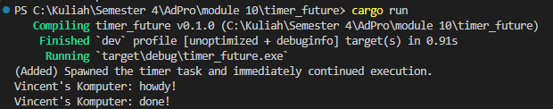

## Experiment 1.2: Understanding how it works
Dalam eksperimen ini, kita menambahkan kode untuk mempelajari urutan eksekusi dalam program asynchronous. Kita menggunakan `spawn()` untuk mengantri sebuah future ke executor dan mencetak pesan sebelum dan sesudah operasi tersebut. Eksperimen ini menunjukkan bagaimana kode asynchronous dieksekusi secara non-blocking. Kita dapat melihat bahwa kode setelah `spawn()` dijalankan segera, tanpa menunggu future selesai. Future itu sendiri akan dijalankan hanya setelah executor mulai mem-poll-nya melalui `executor.run()`.

**Penjelasan:**  
- Baris `println!` dengan tag `(Added)…` dieksekusi segera setelah `spawn`, karena `.spawn()` hanya mengantri future ke executor tanpa menunggu ia selesai.
- Executor kemudian mulai mem-poll task, mencetak `howdy!` saat async block dijalankan, menunggu 2 detik di dalam `TimerFuture`, lalu mencetak `done!`.
- Jadi output muncul dalam urutan: pesan spawn terlebih dahulu, kemudian `howdy!` dari async block, dan akhirnya `done!` setelah timer selesai.