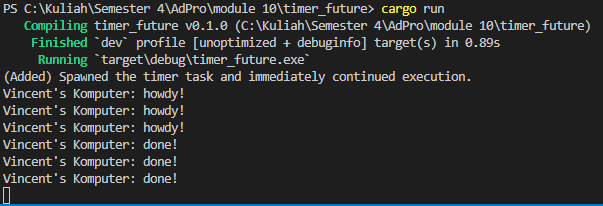

## Experiment 1.2: Understanding how it works
Dalam eksperimen ini, kita menambahkan kode untuk mempelajari urutan eksekusi dalam program asynchronous. Kita menggunakan `spawn()` untuk mengantri sebuah future ke executor dan mencetak pesan sebelum dan sesudah operasi tersebut. Eksperimen ini menunjukkan bagaimana kode asynchronous dieksekusi secara non-blocking. Kita dapat melihat bahwa kode setelah `spawn()` dijalankan segera, tanpa menunggu future selesai. Future itu sendiri akan dijalankan hanya setelah executor mulai mem-poll-nya melalui `executor.run()`.

**Penjelasan:**  
- Baris `println!` dengan tag `(Added)…` dieksekusi segera setelah `spawn`, karena `.spawn()` hanya mengantri future ke executor tanpa menunggu ia selesai.
- Executor kemudian mulai mem-poll task, mencetak `howdy!` saat async block dijalankan, menunggu 2 detik di dalam `TimerFuture`, lalu mencetak `done!`.
- Jadi output muncul dalam urutan: pesan spawn terlebih dahulu, kemudian `howdy!` dari async block, dan akhirnya `done!` setelah timer selesai.

## Experiment 1.3: Multiple Spawn and removing drop
Eksperimen ini memperluas pemahaman kita tentang eksekusi concurrent dengan menambahkan multiple tasks dan menyelidiki efek dari `drop(spawner)`. Kita menambahkan tiga task identik menggunakan `spawn()` untuk melihat bagaimana executor menangani beberapa task secara bersamaan. Eksperimen ini juga mendemonstrasikan pentingnya resource management dalam pemrograman asynchronous. Kami menguji apa yang terjadi ketika channel komunikasi antara spawner dan executor tetap terbuka. Perbedaan perilaku antara menjatuhkan dan mempertahankan spawner menunjukkan bagaimana mekanisme terminasi bekerja dalam sistem asynchronous.

**Penjelasan:**  
1. Dengan 3× `spawn`, executor mem-poll ketiga task secara bergantian, yang menyebabkan program mencetak `howdy!` tiga kali, lalu mencetak `done!` tiga kali setelah masing-masing timer selesai.
2. `drop(spawner)` biasa menutup channel komunikasi antara spawner dan executor. Jika spawner di-drop, `executor.run()` akan keluar ketika semua task yang sudah dijadwalkan selesai dan queue menjadi kosong.
3. Tanpa `drop(spawner)`, channel tetap terbuka, menyebabkan `ready_queue.recv()` terus menunggu kemungkinan task baru, yang mengakibatkan program hang (tidak pernah berakhir).